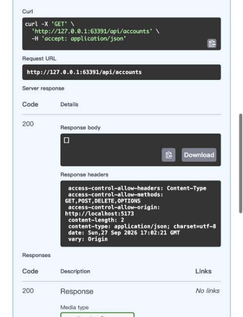

# Web + SQLite milestone — engineering and acceptance report

Date: 2026-09-28. Base: current main `ad18618` (VS Code preview PR #30).
Implementation branch: `codex/web-sqlite`. Compiler remains 0.3.0-alpha.1 /
language 0.8-dev; this work is not a tag, release or deployment.

## A. What changed

| Subsystem | Actual implementation |
|---|---|
| Syntax / typed AST | Source `fn(A) -> R`, arities 0–3, in locals, fields, parameters, returns and generic arguments; `(fn(A) -> R)?` for nullable function values. TypeRef retains result syntax and spans |
| Static semantics | Invariant function parameter/result types; explicit lambda parameter types; nullable invocation diagnostics; Unit only as result; arity diagnostic SPR-TYPE-FUNCTION-ARITY. Lambda construction may use a written expected result under existing expression assignment rules; already-created functions remain invariant |
| JVM boundary | Concrete boxed Fn0–Fn3 signatures preserve callable types in overload resolution. Returned function references remain nullable. Metadata reports `sprigCallableBoundary` and `sprig-callable` interop level; unresolved/raw/wildcard and adapter-requiring slots are rejected |
| Generation | Existing Fn anonymous classes and direct Java calls. Non-null callback argument/result checks preserve nullable generic instantiations; an erased T must not be presumed non-null |
| JSON | Lookup.Missing / Found(value:Value) / NotObject and find_member(value,key), with duplicate object-key rejection; null/false/zero/empty stay distinct |
| HTTP | JDK HttpServer transport and strict UTF-8/URI codec; ordinary Sprig App/Route/Request/Response, GET/POST/DELETE, path/query parameters, headers, JSON, CORS, controlled 400/404/500 |
| OpenAPI | Typed Schema/FieldSchema/QueryParameter metadata; OpenAPI 3.0.3, /openapi.json and pinned CDN Swagger /docs; registration rejects invalid/duplicate schema members, query parameters and equivalent template paths |
| SQLite | Narrow JDBC binding/snapshot/transaction adapter; typed Sprig Parameter variant and SQL-visible Database wrapper. Pinned org.xerial:sqlite-jdbc:3.46.1.0, transitive slf4j-api:1.7.36 through existing Resolver/schema-3 locks |
| Reference backend | Sprig accounts/categories/transactions SQL and handlers, integer minor-unit money, monthly aggregate and delete; actual persisted database |
| CLI / editor | Text run streams stdout immediately and inherits stdin; JSON retains captured envelope. Child cleanup on CLI termination. Sprig: Run in Terminal reuses trusted/save/SDK checks with direct arguments |
| Docs / packaging | Corrected generic/standard-library status drift, executed callable/lookup snippets, library READMEs + structured web API inventory. SDK packaging includes local library sources and excludes generated locks/databases |

Java implements transport/JDBC mechanics, not routing, JSON traversal, SQL,
domain validation or OpenAPI reflection. Existing semantic/codegen boundaries
remain; no new duplicate compiler pipeline or general Java interface inference.

## B. What did NOT change

Numeric types/conversions, checked integer arithmetic, generic invariance,
collection mutability, named Sprig constructors, positional function/JVM calls,
nullability and exhaustive match rules are preserved. Original spec/ design kit
is untouched. Source callable types still carry no recoverable throws effects;
named wrappers must handle those before invocation from a lambda.

Deferred: arbitrary SAM conversion, traits/interfaces, inheritance, async,
coroutines, macros/decorators/annotations, operator overloading, class reflection,
automatic DTO/schema generation, ORM/Spring/MySQL, authentication/JWT/sessions,
WebSocket/multipart, DI, publishing registry, LSP, self-hosting and direct bytecode.
No library arithmetic is silently upgraded to Sprig numeric semantics.

## C. Language pressure discovered

| Pressure | Classification | Decision |
|---|---|---|
| Store/accept a route handler with known Request/Response types | language feature needed | Expose the existing internal FunctionType in source |
| Deliver that callback to a concrete JVM host formal | language feature needed | Only Sprig-owned invariant Fn ABI, not arbitrary SAM |
| Checked parser/JDBC failures in expression lambdas | library API problem | Catch recoverable errors in named wrappers; unchecked host failures become controlled HTTP errors; no effect-system weakening |
| Response.text conceptual static method | library API problem | Canonical web.text(body,status) module function, existing named constructors |
| Long-lived output/termination in CLI and editor | tooling problem | Stream normal text run and add integrated terminal command |
| Byte arrays, generic headers/results, JDBC lifetimes | JVM adapter sufficient | Scalar/snapshot adapters; no array/varargs/interface syntax |
| Automatic schema derivation, concurrency, advanced framework machinery | not worth solving yet | Explicit metadata, synchronous localhost host |

The raw experiment lives at `examples/mini_web/src/host_probe.spr`; it exercises
GET /, GET /hello/<name>, POST /echo before the library abstraction. The full
pressure record is [WEB_DESIGN_PRESSURE.md](WEB_DESIGN_PRESSURE.md).

### Correctness findings repaired during independent review

1. **Nullable generic callable guard.** `make[String?]()` returning
   `fn(T) -> T` passed checking but `identity(null)` threw the newly inserted
   non-null argument error. A generic invocation returning nullable T likewise
   failed. Guards now skip unresolved TypeParameterType; concrete call sites
   retain checks. Both regressions are in tests/callables/types.spr.
2. **Invalid OpenAPI.** Repeated query name q and paths /items/{id} versus
   /items/{name} were accepted. Registration now rejects duplicate (name,in)
   query entries and different paths with identical template shapes. Same path
   with different methods remains valid. tests/web/registration.spr reproduces
   rejection and unchanged route state.
3. **Transaction control bypass.** `;COMMIT`, BOM+COMMIT and mixed prefix comments
   bypassed first-token checks. An insert survived the subsequent batch failure.
   Prefix handling now recognizes those prefixes before rejecting transaction
   statements; the three exact regressions assert rollback.
4. **Failed RETURNING snapshot committed a write.** Duplicate column labels or
   unsupported BLOB in INSERT ... RETURNING raised an adapter error after
   autocommit insertion. query now materializes/closes results inside an explicit
   transaction and rolls back SQL/runtime snapshot failures before returning.
   Independent Java probe asserts row count unchanged.

## D. Java/JVM boundary pressure

- Fn slots use concrete Long/Integer/Double/Float/Boolean/String or Java reference
  types; Void denotes Unit only. Character/Short/Byte slots, arrays, arbitrary
  parameterized Java slots, raw/wildcard/type-variable Fn signatures are rejected
  rather than converted through Object. Nested concrete Fn slots are tested.
- Java-produced callback references remain nullable. Fully known non-null callback
  arguments/results reject ABI violations; nullable generic T is preserved.
- Byte arrays, JDK Headers and JDBC ResultSet never enter the public programming
  model. Rows are detached typed snapshots, not inferred Java List guarantees.
- Prepared parameters separate user values from trusted SQL structure. Operations
  close connection/statement/result scopes; batch and query own rollback/commit.
  No multi-call transaction, cursor, ORM, BLOB, Decimal binding or database URI API.
- SQLite integer access rejects REAL coercion. SQLite SUM overflow is an explicit
  database error, not conversion to Float. Money Int JSON lexemes remain exact;
  a JavaScript UI can still lose integer precision beyond its Number range.
- Missing drivers/locked artifacts, SQL failures and constraint failures remain
  visible. Public responses avoid exposing SQL/JDBC causes; no reflection-based
  DTO conversion or Java numerical guarantee is invented.
- JDK 26 reports the SQLite driver's native-access warning; JDK 17 uses the same
  pinned JDBC library. The warning does not mean the persistence test failed.

## E. Framework ergonomics

Representative source (actual examples contain full schema/validation handling):

```sprig
import "@web/app.spr" as web

func hello(req: web.Request) -> web.Response:
    let name = req.path_param("name")
    let greeting = req.query("greeting")
    if name != null and greeting != null:
        return web.text(greeting + ", " + name, 200)
    return web.text("Hello", 200)

let app = web.App(title="Example", cors_origin="http://localhost:5173")
app.get("/hello/{name}", fn(req: web.Request) => hello(req))
app.run(8080)
```

JSON routes use `req.json()` and `web.json_response(value,status)` with closed
json.Value variants. Metadata is an ordinary `web.Route(method=..., path=...,
handler=..., summary=..., request_schema=..., response_schema=...)`; Schema fields
are explicit typed values. Metadata does not validate a body automatically.

SQL and typed data are visible, for example:

```sprig
let rows = database.query(
    "SELECT id, name FROM accounts WHERE id = ?",
    [sqlite.Parameter.Integer(value=id)]
)
```

See [mini-web](../../../examples/mini_web/README.md),
[SQLite](../../../examples/sqlite/README.md),
[ledger](../../../examples/ledger/README.md),
[web API](../../../libraries/sprig-web/README.md), and
[SQLite API](../../../libraries/sprig-sqlite/README.md).
Agent discovery also uses capabilities/help, stable diagnostics, `sprig api`,
and libraries/sprig-web/api.json. Invented decorators/static factories/SAMs are
not accepted. TextMate highlighting needs no new language server.

## F. Remaining blockers before a full Personal Ledger rewrite

- Authentication, authorization, users, sessions/JWT and public deployment are
  absent. The host binds loopback, serializes requests and loads bodies in memory;
  it is a development backend, not a production server contract.
- Whole JDBC snapshots are capped at 10,000 rows. Pagination, migrations, pooling,
  transactions spanning calls, backups and richer database kinds need engineering
  work before a full ledger migration; they do not require new syntax now.
- Route metadata is explicit and limited; no automatic validation, general schema
  references/union/nullable schema derivation or rich response negotiation.
- Swagger CDN assets require network; local bundled assets remain deferred.
- Transport-level malformed UTF-8 is rejected before App dispatch, so that host
  400 currently lacks App CORS headers. Application JSON400/404/500 carry CORS.
- Financial/business rules, timezone/currency handling and numerical stability
  remain application responsibilities. Type safety is not an algorithm proof.
- New adapters were exercised locally on macOS; Linux/Windows hosted execution
  and a publication decision are separate evidence, not claimed here.

## Actual verification and evidence layers

Before implementation: `./scripts/verify.sh` **passed**, including build, existing
compiler/JVM tests, independent ANTLR grammar, executed docs, VitePress and editor.
`bin/sprig version` reported 0.3.0-alpha.1; capabilities and doctor JSON were
captured. `version --json` is rejected by the existing CLI contract.

| Command / evidence | Result |
|---|---|
| `python3 tests/callables/check_callables.py` | 25 checks passed: source types, negative checks, generated Java/JVM, boxing, nested Fn, reference callback, null ABI failure, metadata |
| `python3 tests/web/check_web.py` | Actual loopback HTTP/raw host/library, readiness streaming, cleanup/port release, lifecycle, registration validation, structural OpenAPI/docs passed |
| `python3 tests/sqlite/check_sqlite.py` | Actual Central resolve + schema3, JDBC probe, prepared values, typing/null, rollback/resources, persistence and ledger HTTP/restart passed |
| `python3 tests/sqlite/check_sqlite.py --offline` | Same integration with warmed locked cache passed |
| `python3 scripts/test-stdlib.py` | Existing std contract plus lookup distinctions and duplicate policy passed |
| `python3 scripts/check-docs.py` | Executed snippets, consistency, VitePress and links passed |
| VS Code npm tests/package | 17 tests and VSIX package passed; actual trusted Extension Host terminal executed Unicode/metacharacter path; Restricted Mode rejected terminal creation |
| Browser Swagger | CDN rendered actual ledger operations; Try it out / Execute GET /api/accounts returned 200 and []; request URL/status/body inspected, screenshot recorded. Automated tests additionally create account/category/transaction, totals and persistence |
| JDK 17.0.19 targeted runs | Callable25, real web HTTP and offline SQLite/ledger suites passed; default local gate uses JDK26.0.1 |
| `python3 scripts/package-alpha.py --skip-build` then `python3 tests/web/check_sdk.py dist/sprig-v0.3.0-alpha.1-jdk.zip` | Development archive passed relocated spaced-path project resolution/checks, SQLite persistence and web lifecycle; local locks/databases excluded |
| Final `./scripts/verify.sh` | Passed, exit 0: build, 77 test gates/cases (0 failed), 66 numeric checks, 26 grammar cases, 20 executed documentation snippets, VitePress production build, 92 Markdown files / 178 local link targets, 17 editor tests and VSIX packaging |

An SDK probe using an absolute alternate macOS /var path initially lost project
context because discovery uses /private/var. The existing source-root prefix
comparison was unchanged by this milestone; documented project-relative commands
work. This path-alias limitation remains recorded rather than silently broadening
project discovery during the web work.

Final verification includes the new callable, web and SQLite suites in the
canonical test driver. Parser acceptance, static rejection, javac execution,
JVM callback execution, HTTP and database persistence are separately asserted.
No original golden output or correct assertion was weakened. The first final gate passed
77 test gates/cases, 26 grammar cases and 20 snippets, then failed on a dead
Chinese website JVM link. That new link was fixed; the complete gate was rerun
and passed with exit 0. A temporary docs
run collided with rebuilding build/classes (ClassNotFoundException); rerunning
after the build completed passed. This was execution ordering, not a language
failure. No hosted platform/release/CDN-offline claim follows from local tests.



AI assistance: compiler/library/editor changes and review were AI assisted;
this report records commands actually run and independent repro-based repairs.
